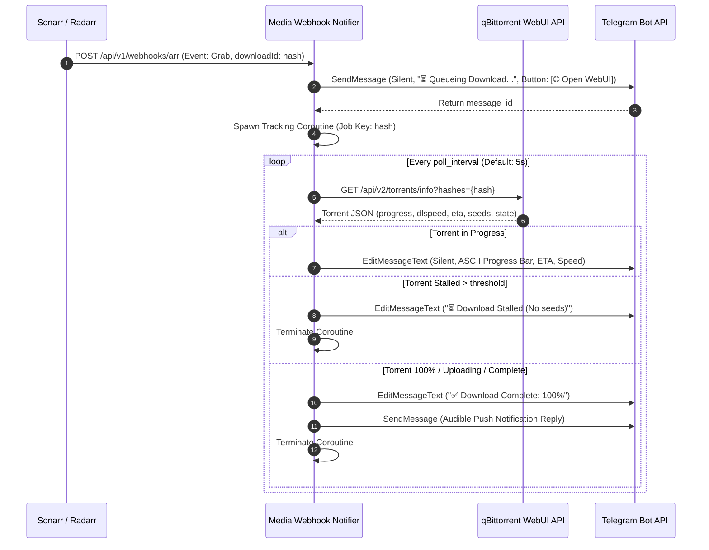

# Media Webhook Notifier (`media-webhook-notifier`)
## Functional & Technical Specification

`media-webhook-notifier` is a high-performance, lightweight microservice designed to ingest webhooks from the **Servarr stack** (Sonarr, Radarr, Lidarr, Readarr, Bazarr, Prowlarr), **Media Servers** (Plex, Jellyfin), and **Download Clients** (qBittorrent), transforming them into rich, real-time notification cards with in-place live progress tracking.

---

## 1. Core Objectives & Design Philosophy

1. **Zero Intermediate Middleware Dependency:**
   - Directly ingests and filters native Plex webhooks (e.g. `library.new`) with minimal memory overhead, removing the need for Tautulli.
   - Compatible with both **Plex** and **Jellyfin** (single active media server mode per deployment).
2. **Hexagonal Architecture (Ports & Adapters):**
   - Decouples the core domain logic from HTTP routers, download client drivers, and notification sinks.
   - Allows swapping or adding new notification providers (Telegram, Ntfy, Discord, Pushover) without touching business rules.
3. **High-Performance Native Runtime:**
   - Built with **Kotlin 2.x** and **Kotlin Coroutines (`kotlinx.coroutines`)**.
   - Compiled ahead-of-time (AOT) to a standalone native binary using **GraalVM Native Image** for **<25ms cold startup** and **<25 MB RSS memory**.
   - Type-safe, declarative functional error handling powered by **Arrow-kt (`Either`, `Raise` DSL)**.
4. **Interactive Real-Time UX:**
   - Live in-place message updates on Telegram during active downloads (ASCII progress bar, ETA, speeds, peers, WebUI link).
   - Rich "Now Available" cards with high-resolution artwork, media codec specifications, and direct playback links.

---

## 2. Inbound Webhook Ingestion Matrix

The service exposes a unified, self-documenting HTTP API with OpenAPI 3.1 / JSON Schema endpoints.

```
                  ┌──────────────────────────────────────────────────────────┐
                  │                 INBOUND WEBHOOK ROUTER                   │
                  └──────────────────────────────────────────────────────────┘
                                               │
             ┌─────────────────────────────────┼─────────────────────────────────┐
             ▼                                 ▼                                 ▼
   [Servarr Ingest Port]              [Plex Ingest Port]               [Jellyfin Ingest Port]
  /api/v1/webhook/sonarr             /api/v1/webhook/plex             /api/v1/webhook/jellyfin
  /api/v1/webhook/radarr             /api/v1/webhook/{token}/plex     /api/v1/webhook/{token}/jellyfin
  - Formats: Sonarr, Radarr, Servarr  - Form: multipart / JSON         - Format: JSON (Webhook plugin)
```

### 2.1 Servarr Ingest (`/api/v1/webhook/sonarr`, `/api/v1/webhook/radarr`, `/api/v1/webhook/servarr`)
* **Supported Apps:** Sonarr (TV & Anime), Radarr (Movies), Servarr generic, Lidarr, Readarr.
* **Events Handled:**
  - `Grab`: Extracts torrent hash (`downloadId`), media title, release metadata, size, and dispatches the **Live Download Tracking Job**.
  - `Download` / `Upgrade` (Import): Extracts file details, codecs, resolutions, artwork URLs, and dispatches **Media Ready Event**.
  - `Rename` / `Test`: Diagnostic and health reporting.
* **Authentication:** HTTP Header (`Authorization: Bearer <token>` or `X-Api-Key: <token>`) or Query Parameter (`?token=<token>`).

### 2.2 Plex Ingest (`/api/v1/webhook/plex`)
* **Ingest Mechanism:** Plex sends `multipart/form-data` with a stringified JSON parameter `payload` and optional binary thumbnail.
* **Events Handled:**
  - `library.new`: Native Plex notification when a movie or episode scan finishes and metadata is indexed.
  - `media.play`, `media.pause`, `media.stop`, `media.scrobble`: Stream monitoring (configurable / ignored by default to prevent overhead).
* **Deep Linking:** Generates direct client links:
  ```text
  https://plex.example.com/web/index.html#!/server/{machineIdentifier}/details?key={ratingKey}
  ```
* **Authentication:** Query parameter (`?token=<token>` or `?apikey=<token>`) or Header.

### 2.3 Jellyfin Ingest (`/api/v1/webhooks/jellyfin`)
* **Ingest Mechanism:** Jellyfin Webhook Plugin JSON payloads.
* **Events Handled:**
  - `ItemAdded`: Fired when library scanner finishes indexing new media.
  - `PlaybackStart` / `PlaybackStop`: Optional playback events.
* **Deep Linking:**
  ```text
  https://jellyfin.example.com/#!/details?id={itemId}&serverId={serverId}
  ```

---

## 3. Downloader Engine & Live Tracking Workflow

When an `On Grab` event arrives with a valid torrent hash:



### Concurrency & State Management:
* **Coroutine Supervisor:** Each torrent download runs in an isolated, cancellable `CoroutineScope` bound to the application lifecycle.
* **Debounce & Batching Channel:** Multiple episodes grabbed simultaneously (e.g. full season pack) are grouped within a configurable debounce window (`debounce_window: 5s`) to prevent chat flooding.
* **Deterministic Circuit Breakers:**
  - `max_polling_duration`: 30 minutes (configurable).
  - `stalled_threshold`: 15 minutes of 0 MB/s progress.
  - `missing_grace_attempts`: 6 consecutive cycles before declaring removed.

---

## 4. Telegram Card Specifications & Templates

### 4.1 Live Download Progress Card
```text
📥 Downloading: Severance - S02E01 - Hello World
━━━━━━━━━━━━━━━━━━━━━━
Progress: 42% [████░░░░░░]
Speed:    14.2 MB/s • ETA: 3m 45s
Size:     2.1 GB / 5.0 GB
Status:   downloading (Peers: 18/4)
```
**Inline Keyboard:** `[🌐 Open WebUI]` (`https://downloads.example.com`)

---

### 4.2 Media Available Card (Plex / Jellyfin Scanned)
Delivered with high-resolution TMDB/TVDB poster image (`SendPhoto` with HTML caption):

```text
🍿 Now Available: Dune: Part Two (2024)
━━━━━━━━━━━━━━━━━━━━━━
⭐ TMDB: 8.5/10 • ⏱ 2h 46m • 📅 2024
🎭 Sci-Fi, Adventure, Action

🎞 Video:  2160p UHD • HDR10 • HEVC
🔊 Audio:  Dolby Atmos • TrueHD 7.1
💾 Size:   27.1 GB (Quality Upgrade ⬆️)

Paul Atreides unites with Chani and the Fremen while seeking revenge...
```
**Inline Keyboard:**
* Row 1: `[🎬 Watch on Plex]` `[🍿 Watch on Jellyfin]`
* Row 2: `[📁 Open in Radarr / Sonarr]`
